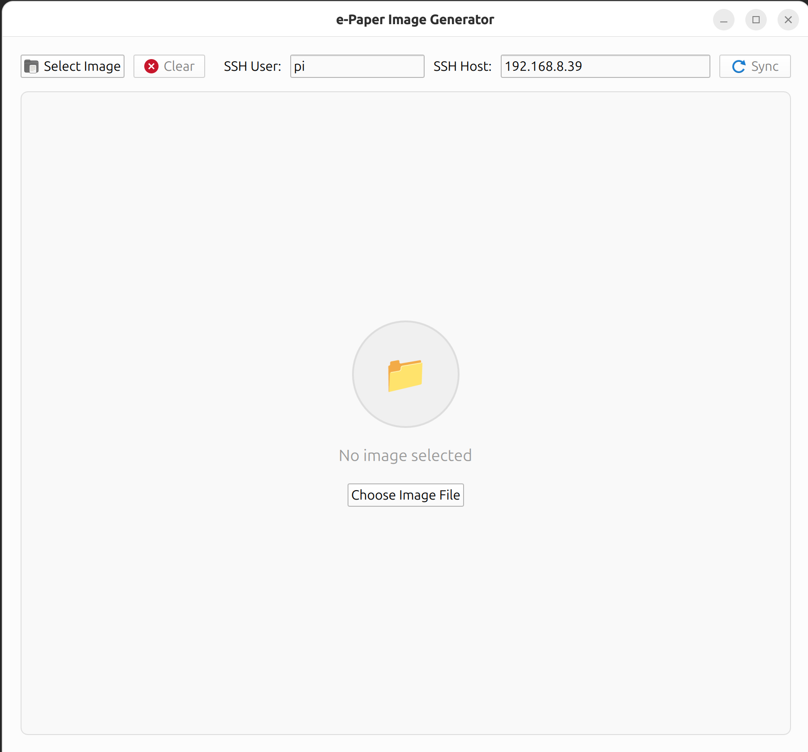
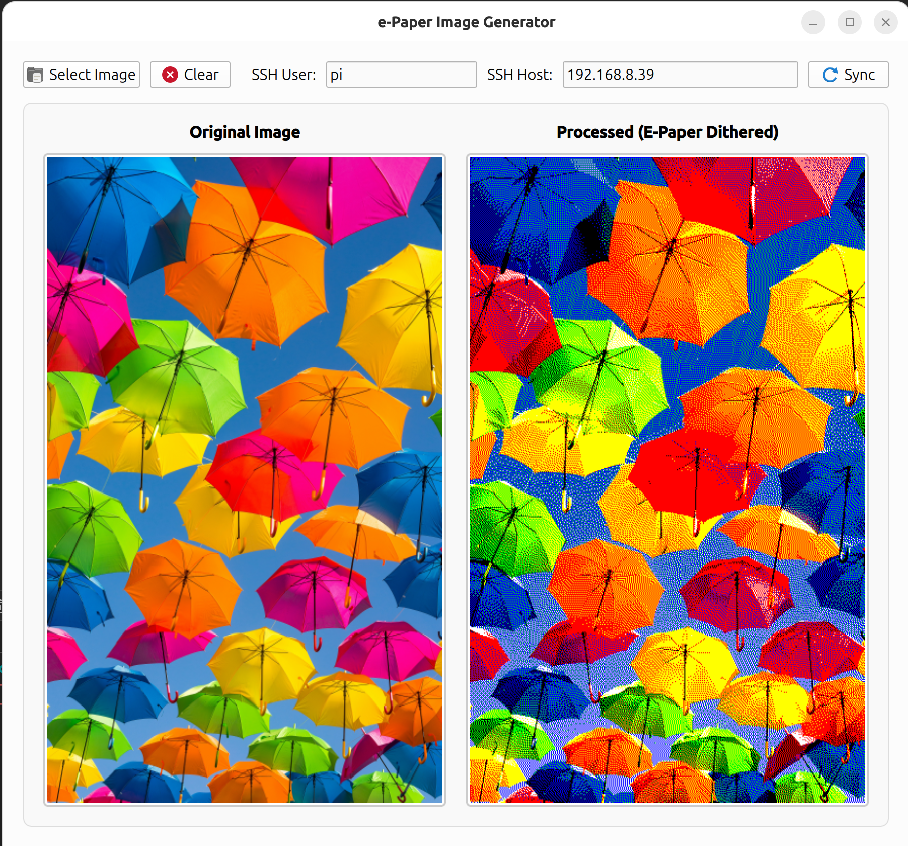
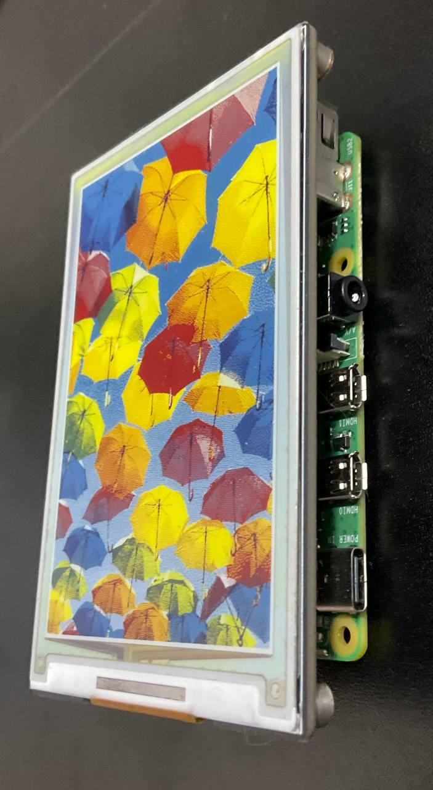
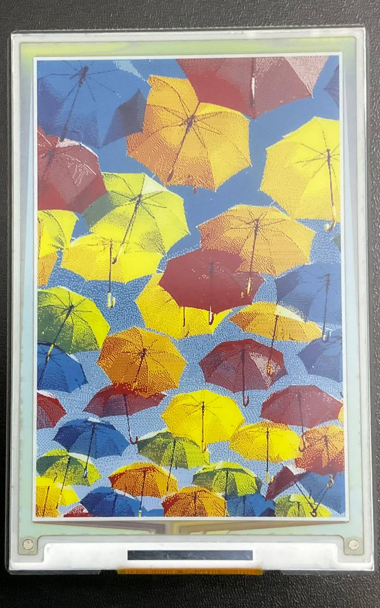

# RPi E-Paper Display

<p align="center">
  
  
</p>

<p align="center">
  
  
</p>

## Prerequisites

- Raspberry Pi with RPi OS Lite (flash to SD card)
- E-Paper display module
- Linux development machine with Qt installed

## Setup

### On Linux (Development Machine)

Find your host IP address:

```bash
hostname -I
```

Search for Raspberry Pi IP address:

```bash
nmap -sn <host_address>/24
```

Generate an SSH key pair:

```bash
ssh-keygen -t ed25519 -C "qt-deployer" -f ~/.ssh/id_ed25519
```

Copy the public key to the Raspberry Pi:

```bash
ssh-copy-id -i ~/.ssh/id_ed25519.pub <username>@<remote_address>
```

Clone the repository:

```bash
git clone https://github.com/AhmadRoshanfar/EPaper-Photo.git
cd RPi-EPaper
```

Transfer project files to Raspberry Pi:

```bash
scp -r ./RPi-EPaper pi@192.168.8.39:~
```

### On Raspberry Pi (Target Device)

Enable SPI interface:

```bash
sudo raspi-config nonint do_spi 0
```

## Usage

1. Run the Qt application on your development machine
2. Choose your image
3. Enter username and host address
4. Press **Sync** and wait until the image uploads to the display

## Building and Deployment

### 1. Compile the Project

Build the project in **Release** mode using Qt Creator.

### 2. Install CQtDeployer

```bash
sudo snap install cqtdeployer --classic
```

### 3. Deploy the Application

Navigate to the build directory:

```bash
cd build/Desktop_Qt_6_9_3-Release
```

Run CQtDeployer:

```bash
cqtdeployer -bin ./appEPaper_Qt \
            -qmake /opt/Qt/6.9.3/gcc_64/bin/qmake \
            -qmlDir ../../
```

### 4. Locate the Deployed Application

The deployed application will be available in:

```
build/Desktop_Qt_6_9_3-Release/DistributionKit/bin/
```
